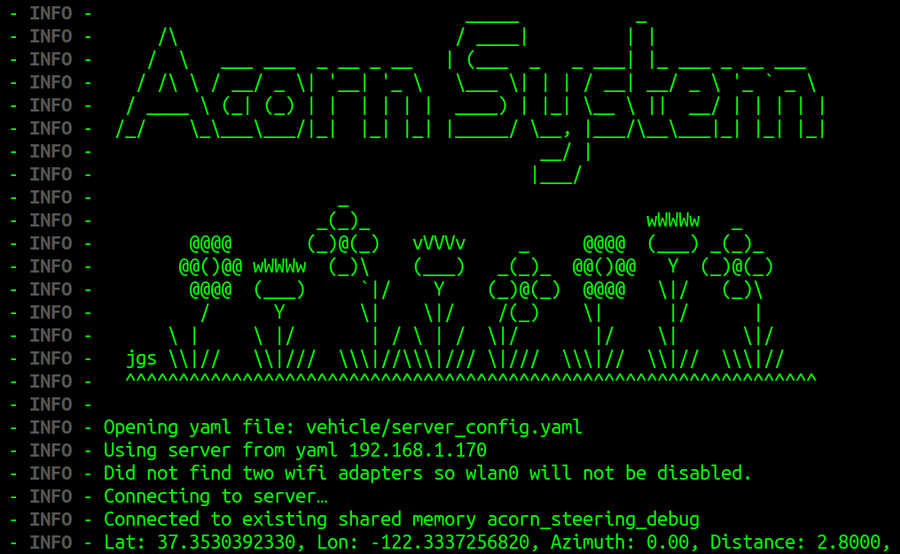

## Running the code in simulation

It is now possible to run a simulated robot in Docker on
your computer. Our launch scripts are designed to run in linux, but if
you examine run_docker_simulation.sh you will see the commands needed.

This is early stages alpha quality and at this time only rough notes follow.

Install docker on your system:
https://docs.docker.com/engine/install/

For example for Ubuntu follow these instructions:
https://docs.docker.com/engine/install/ubuntu/

Follow the post-installation steps for docker so regular users can launch
containers:
https://docs.docker.com/engine/install/linux-postinstall/

Install docker-compose for your platform.
https://docs.docker.com/compose/install/

Clone this git repo and change in to the directory.
```
git clone https://github.com/Twisted-Fields/acorn-precision-farming-rover.git
cd acorn-precision-farming-rover
./run_docker_simulation.sh
```

The docker container will now (hopefully) build and launch. This will take
some time. If it fails, please post a github issue. Note that several ports
must be available on the host including port 80. You may need to disconnect
from VPN when running this.

The command runs two docker containers: the normal server container, and a
simulated robot vehicle container. The simulated vehicle stubs out all
hardware and sensors return fake data. This was originally intended primarily
for integration testing but it has proven useful for navigation software
development.

Now you should be able to open the User Interface in your browser on:
http://localhost

The UI will be refactored later. For now use the following steps to load a
navigation path and run the simulated robot:
- click `select a path` and then e.g. `aaa_test3`.
- click `Load Path` on the Right. The Loaded Path Name should appear on the right.
- click `Clear Autonomy Hold`.
- click `Activate Autonomy`. The Rover will follow the loaded path.


To get some Debut Output connect to the vehicle container:
```
./attach_docker_vehicle.sh
```
Multiple processes are running in separate tmux sessions. The vehicle has a main
process and a separate motor process.
```
/home/acorn # tmux ls
main: 1 windows (created Mon Aug 30 21:07:27 2021)
motors: 1 windows (created Mon Aug 30 21:07:27 2021)
```
Connect to the main process:
```
tmux a -t main
```
You should see a lot of output scrolling by the screen. Look for example for
GPS values.

To exit tmux, do not press Ctrl-C as that will kill the process. Instead tmux
uses a special key combination followed by different keys as different commands.
To exit, press Ctrl+B and then press D (for detach)

You can connect to the motors with:
```
tmux a -t motors
```

Note that you do not need to type the full tmux session name - just enough
letters to distinguish between them. Detach from the motors tmux session and
run:
```
tmux a -t mo
```
or
```
tmux a -t ma
```
And you will be connected to the motors or main tmux session, respectively.

Exit out of any tmux windows, and at the root prompt of the container press
Ctrl+D to exit the docker container without stopping it.

The server is configured the same way, but with more tmux windows operating.
Attach to the server docker container with:
```
./attach_docker_server.sh
```

And explore the tmux windows there.

Now open a browser and enter "localhost" in the URL bar. The web page should
load. This is an engineering interface and we expect to make improvements before
deploying to end users. This interface allows us to recall GPS tracks from
the database, load them on to Acorn, enable and disable autonomy, and monitor
robot status.

If you are done, exit any tmux windows and docker containers and then stop
simulation with:
```
./stop_docker_simulation.sh
```

Want to play around a little more before stopping the simulation? One thing to
try is running the main process yourself. Connect back to the vehicle container,
and attach to the main process as before. But hit Ctrl-C to kill the process.
The tmux container will exit and you will be sitting at the prompt inside the
docker container.

Now run:
```
python3 vehicle/main_process.py --sim
```
or:
```
python3 vehicle/main_process.py --sim --debug
```
When you are making changes to the vehicle code, often this is how you will want
to run things. Instead of restarting the entire simulation environment, you can
often just re-run this process to see your changes.

If you have made it this far, you are really important to us! We want to know
what you think of our software. Please sign up or log in to
[community.twistedfields.com](https://community.twistedfields.com/) and let us
know if you got the code running. This process is still an alpha release and
all user reports are valuable.
